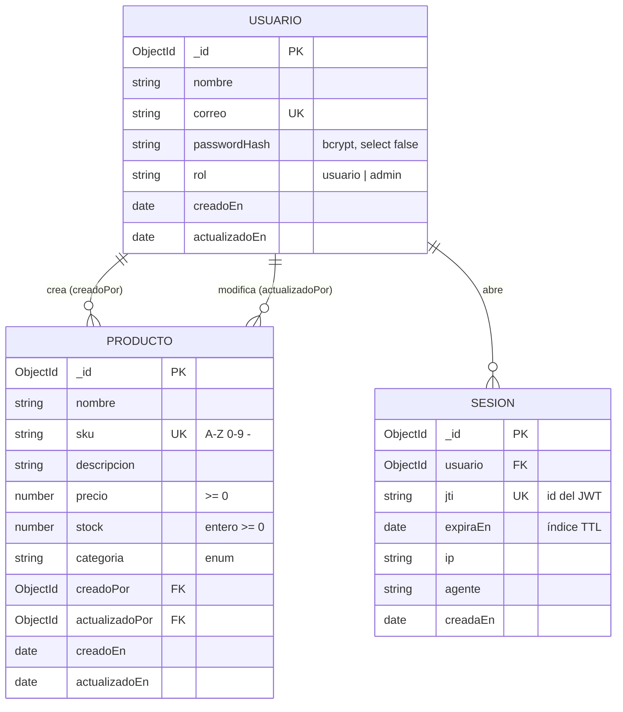

# Diagrama entidad-relación

```mermaid
erDiagram
    USUARIO ||--o{ PRODUCTO : "crea (creadoPor)"
    USUARIO ||--o{ PRODUCTO : "modifica (actualizadoPor)"
    USUARIO ||--o{ SESION : "abre"
    USUARIO {
        ObjectId _id PK
        string nombre
        string correo UK
        string passwordHash "bcrypt, select false"
        string rol "usuario | admin"
        date creadoEn
        date actualizadoEn
    }
    PRODUCTO {
        ObjectId _id PK
        string nombre
        string sku UK "A-Z 0-9 -"
        string descripcion
        number precio ">= 0"
        number stock "entero >= 0"
        string categoria "enum"
        ObjectId creadoPor FK
        ObjectId actualizadoPor FK
        date creadoEn
        date actualizadoEn
    }
    SESION {
        ObjectId _id PK
        ObjectId usuario FK
        string jti UK "id del JWT"
        date expiraEn "índice TTL"
        string ip
        string agente
        date creadaEn
    }
```
